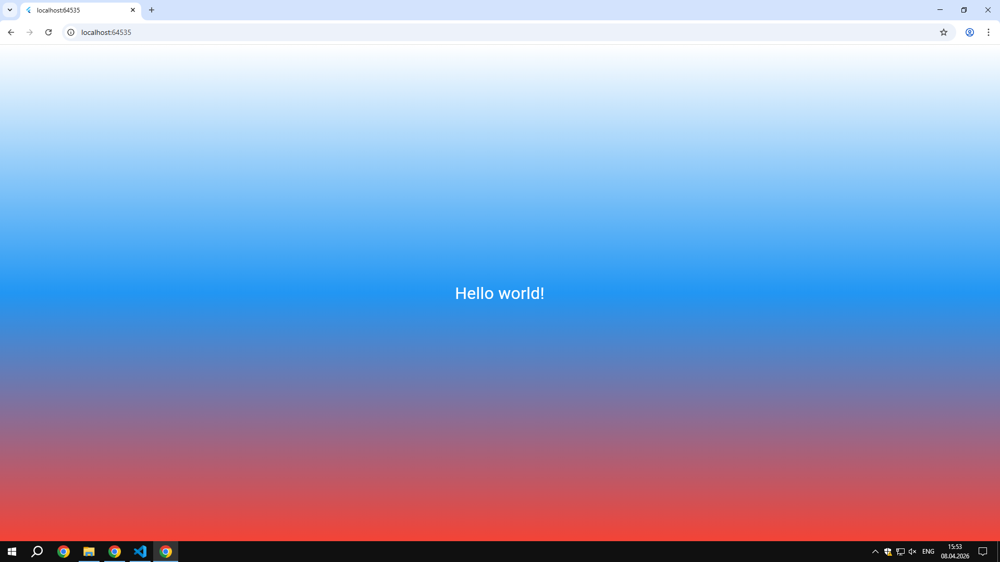

# Лабораторная работа №2. Знакомство с Flutter. Первое Flutter-приложение.
Простое Flutter-приложение, созданное в рамках знакомства с кросс-платформенной разработкой. Демонстрирует базовые виджеты, управление состоянием и механизм горячей перезагрузки (Hot Reload).

## Автор
- **Имя:** Зламанюк А.А.
- **Группа:** ИСП-231

## Стек и версии
- **Flutter:** 3.41.2
- **Dart:** 3.11.0
- **Платформа:** Web (Chrome)
- **IDE:** VS Code

## Скриншот приложения


## Как запустить
1. Клонировать репозиторий:
   ```bash
   git clone (https://github.com/AnastasiaZlamanyuk/kotlin_LAB2_Flutter.git)
   ```
2. Перейти в папку проекта:
   ```bash
   cd Flutter_Lab2
   ```
3. Установить зависимости:
   ```bash
   flutter pub get
   ```
4. Запустить в Chrome:
   ```bash
   flutter run -d chrome
   ```
## Что изучили:
- Структуру Flutter-проекта и основные папки (`lib/`, платформенные папки)
- Разницу между `StatelessWidget` и `StatefulWidget`
- Управление состоянием через `setState()` (аналог `mutableStateOf()` в Jetpack Compose)
- Горячую перезагрузку (`r`) vs горячий перезапуск (`R`)
- Базовые виджеты: `MaterialApp`, `Scaffold`, `Container`, `Center`, `Text`
- Стилизацию текста через `TextStyle` и создание градиентов через `BoxDecoration` + `LinearGradient`
- Работу с Flutter DevTools и Flutter Inspector
